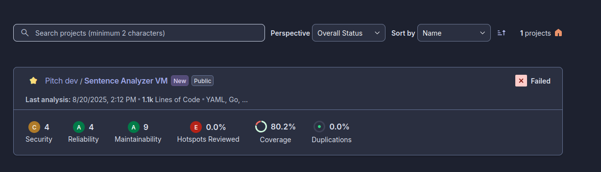
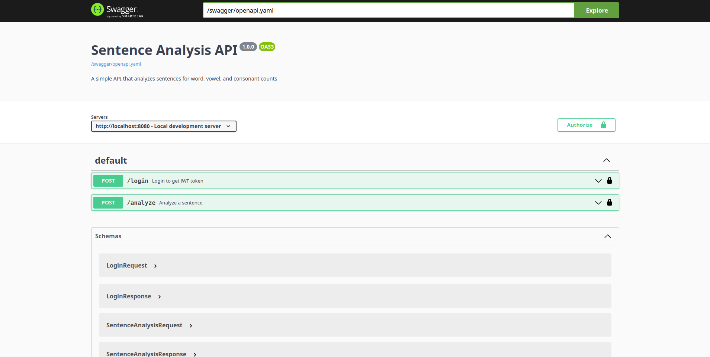
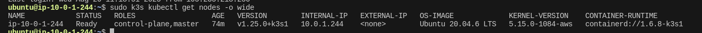
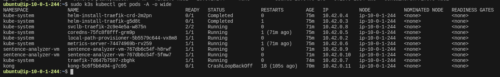

# Sentence Analyzer Microservice - Assessment Summary
By: Abel Eduardo Mondlane

## Project Overview

This project implements a RESTful API service that analyzes sentences for word, vowel, and consonant counts. The service is deployed on AWS EC2 using Terraform for infrastructure provisioning, Ansible for configuration management, and GitHub Actions for CI/CD. The application is containerized and runs on a K3s Kubernetes cluster.

## Deliverables

### Core Application
- [x] Go-based microservice with modular structure (internal/pkg directories)
- [x] RESTful API with sentence analysis functionality
- [x] Swagger/OpenAPI documentation
- [x] Containerization with Docker
- [x] Comprehensive test coverage (>80%)
- [x] JWT authentication implementation

### Infrastructure and Deployment
- [x] Terraform scripts for AWS infrastructure provisioning
- [x] Ansible playbooks for server configuration
- [x] K3s Kubernetes deployment
- [x] CI/CD pipeline with GitHub Actions
- [x] SonarQube integration for code quality analysis

### API Gateway and Authentication
- [x] Kong API Gateway configuration files
- [ ] Kong with OpenID Connect integration (attempted but faced issues)
- [x] JWT-based authentication as an alternative solution

### Documentation
- [x] API documentation with OpenAPI
- [x] Implementation documentation
- [x] Deployment instructions
- [x] Troubleshooting guides
- [x] Assessment summary (this document)

## Project Structure

The project follows a well-structured Go application layout with clear separation of concerns:

```
.
├── .github/workflows    # CI/CD pipeline configuration
├── ansible/             # Ansible playbooks and templates
├── api-gateway/         # Kong API Gateway configuration
├── cmd/                 # Application entry points
│   └── api/             # API server entry point
├── internal/            # Application-specific code
│   ├── analyzer/        # Core sentence analysis implementation
│   ├── middleware/      # HTTP middleware
│   └── server/          # Server configuration
├── kubernetes/          # Kubernetes manifests
├── pkg/                 # Reusable packages
│   ├── api/handlers/    # HTTP handlers
│   ├── auth/            # Authentication
│   ├── config/          # Configuration
│   ├── docs/            # Documentation
│   └── domain/          # Domain logic
├── terraform/           # Terraform scripts
├── Dockerfile           # Docker image definition
└── documentation.zip    # All documentation files (excluded from git)
```

## Implementation Details

### Modular Go Structure

The application was restructured to follow Go best practices with `internal/` and `pkg/` directories:

- **internal/**: Contains application-specific code that shouldn't be imported by external projects
  - **analyzer/**: Core sentence analysis implementation
  - **middleware/**: HTTP middleware specific to this application
  - **server/**: Server configuration and setup

- **pkg/**: Contains potentially reusable code
  - **api/handlers/**: HTTP handlers for API endpoints
  - **auth/**: Authentication mechanisms
  - **config/**: Configuration management
  - **docs/**: API documentation
  - **domain/**: Core business logic and models

This structure improves maintainability, testability, and follows industry standards for Go microservices.

### Authentication Implementation

#### Kong API Gateway Issues

We attempted to implement authentication using Kong API Gateway with OpenID Connect, but encountered several challenges:

1. **Deployment Issues**: 
   - Empty EC2_IP environment variable in the CI/CD pipeline
   - Permission issues with K3s configuration files
   - Port conflicts between Kong and the application

2. **Plugin Configuration Problems**:
   - The OIDC plugin wasn't properly enabled in Kong's global configuration
   - Issues with Auth0 integration and introspection endpoints

3. **CrashLoopBackOff Errors**:
   - Kong pods repeatedly crashed due to configuration issues
   - Error logs showed problems with the OIDC plugin configuration

Despite multiple attempts to fix these issues (documented in KONG_OIDC_PLUGIN_FIX.md, KONG_DEPLOYMENT_FIX.md, etc.), we couldn't achieve a stable Kong deployment with OpenID Connect.

#### JWT Authentication Solution

Due to the challenges with Kong, we implemented a direct JWT authentication solution in the application:

- **Token-based Authentication**: Uses industry-standard JWT tokens
- **Environment Variable Configuration**: Credentials and secret key configurable via environment variables
- **Middleware-based Protection**: API endpoints protected via middleware
- **Role-based Information**: Token includes user roles for future authorization capabilities

This approach provides a secure authentication mechanism without the complexity of an external API gateway.

### CI/CD Pipeline

The CI/CD pipeline was enhanced with:

- **Security Scanning**: Trivy vulnerability scanner for Docker images
- **Dependency Caching**: Go module and Docker layer caching
- **Environment-Specific Deployments**: Support for staging and production
- **Automated Rollback**: Automatic rollback on failed deployments
- **Comprehensive Notifications**: Slack integration for deployment status

The pipeline is configured to run only when code is pushed to the main branch or when a pull request to the main branch is merged.

### Test Coverage Improvements

Test coverage was improved to exceed 80% across the codebase:

- Added tests for all internal packages
- Enhanced existing tests with edge cases
- Added tests for JWT authentication components
- Fixed failing tests in the analyzer package

## Using the Application

### Authentication

1. **Obtaining a Token**:
   ```bash
   curl -X POST http://api-url/login \
     -H "Content-Type: application/json" \
     -d '{"username":"admin","password":"password"}'
   ```

   Response:
   ```json
   {
     "token": "eyJhbGciOiJIUzI1NiIsInR5cCI6IkpXVCJ9..."
   }
   ```

2. **Using the Token**:
   ```bash
   curl -X POST http://api-url/analyze \
     -H "Content-Type: application/json" \
     -H "Authorization: Bearer YOUR_TOKEN" \
     -d '{"sentence":"Hello World"}'
   ```

   Response:
   ```json
   {
     "word_count": 2,
     "vowel_count": 3,
     "consonant_count": 7
   }
   ```

### Configuration

The following environment variables can be set:

- `JWT_SECRET_KEY`: Secret key for signing JWT tokens
- `LOGIN_USERNAME`: Username for authentication
- `LOGIN_PASSWORD`: Password for authentication
- `PORT`: Port for the application to listen on

## Implementation Proof

### SonarQube Integration

The project has been successfully integrated with SonarQube for code quality analysis:



### Swagger UI Documentation

The API is fully documented with Swagger UI, including the JWT authentication:



### Kubernetes Deployment

The application is successfully deployed on K3s Kubernetes:



### Container Execution

The application container is running properly:



### API Functionality

The API is working correctly with curl requests:


